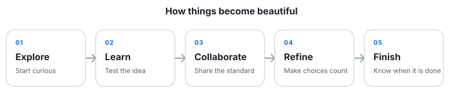

# O S

### Done is beautiful, Beautiful is better!

  <em>Ex nihilo nihil fit.</em> 
  Nothing comes from nothing.

### 👋 Hi, I’m **@os-ogoat**

I’m O S. This profile is a focused record of the ideas and projects I choose
to share publicly.

### 👀 I’m interested in **most things**

Curiosity is the starting point. I stay open to different ideas, then give
careful attention to the ones that are useful, clear, and worth finishing.

### 🌱 I’m currently learning **new things**

Learning is an active process: understand the problem, test assumptions, apply
what works, and refine the result.

### 💞️ I’m looking to collaborate on **some things**

Good collaboration begins with clear expectations, thoughtful communication,
and a shared commitment to quality.

### 📫 How to reach me **through things**

GitHub provides the public context for the work shared here.

### 😄 Pronouns: **non of those things**

Personal labels stay personal; this profile keeps the focus on the work.

### ⚡ Fun fact: **Interesting things**

The interesting part is not adding more. It is making every choice earn its
place—and knowing when the work is done.

### 🗂️ Things on GitHub

[`os-ogoat`](https://github.com/os-ogoat/os-ogoat) is the source for this
profile. [`diagram-design`](https://github.com/os-ogoat/diagram-design) is a
fork; its original project and history remain with the upstream repository.
