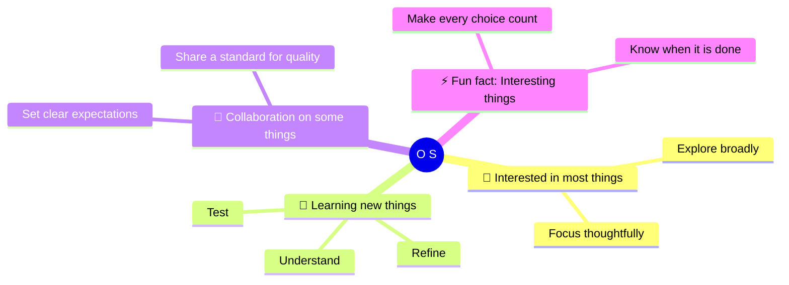

# O S

### Done is beautiful, Beautiful is better!

`curious by default` · `deliberate by practice` · `finished with care`

### 📫 How to reach me: through things

GitHub is the public point of contact for the work and context shared here.

### 😄 Pronouns: none of those things

Personal labels stay personal; this profile keeps the focus on the work.

### 🗂️ Things on GitHub

[`os-ogoat`](https://github.com/os-ogoat/os-ogoat) is the source for this
profile. [`diagram-design`](https://github.com/os-ogoat/diagram-design) is a
fork; its original project and history remain with the upstream repository.
